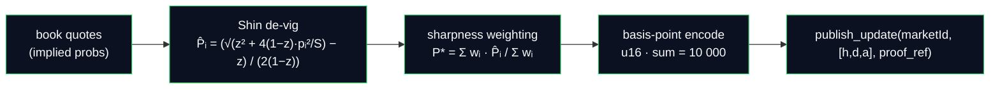
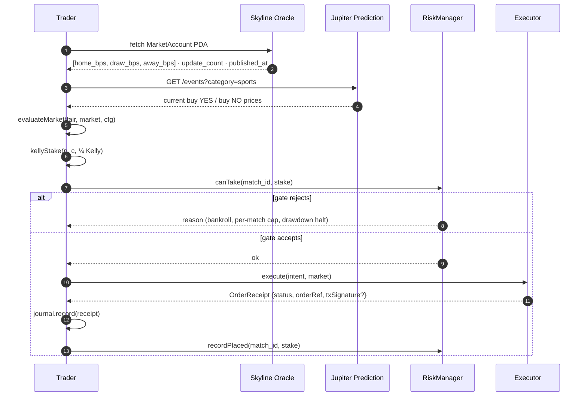

<div align="center">

# Skyline

**Sharp consensus, on-chain.**

A permissionless sports-outcome oracle on Solana. It aggregates 120+ bookmakers via TxLINE, publishes fair-value probabilities on-chain as basis-point PDAs any Solana program can deserialize, and ships an autonomous trader that reads the oracle and executes against Jupiter Prediction.

[](https://explorer.solana.com/address/GfqqReCNqXhF23RpijJEV9TKu2tVGbK1ucmmmicTK5c6?cluster=devnet)
[](https://www.anchor-lang.com/)
[](https://txline.txodds.com/)
[](https://developers.jup.ag/docs/guides/how-to-build-a-prediction-market-app-on-solana)
[](https://skyline-fawn.vercel.app)

</div>

---

Skyline is the **on-chain bridge between institutional sports data and Solana execution venues**. It reads TxLINE's cross-book StablePrice consensus, packages every fair-value update as a Solana PDA carrying a reference hash to the TxLINE Merkle proof, and exposes those PDAs to any Solana program — no permission, no rate limit, no middleman. A companion autonomous trader consumes the oracle, prices Jupiter Prediction markets, sizes edges with fractional Kelly, and routes every intent through a portfolio risk manager.

## The gap Skyline closes

Sportsbooks have institutional-grade data — 120+ books, sharp consensus, ~10 ms tick latency, decades of proprietary tooling. On-chain prediction markets have permissionless execution, cryptographic settlement, and thin liquidity with slow price discovery. Nothing on Solana turns the first into infrastructure the second can consume.

Skyline is that infrastructure: a `MarketAccount` PDA per fixture, holding sharp-consensus `home_prob_bps` / `draw_prob_bps` / `away_prob_bps` alongside a `txline_proof_ref` any consumer can verify against TxLINE's on-chain program. Think of it as *Pyth for sports outcomes*.

## What lives on-chain

| Account | Seeds | Fields |
|---|---|---|
| `PublisherRegistry` | `[b"publisher"]` | `authority`, `name`, `published_count`, `created_at` |
| `MarketAccount` | `[b"market", market_id (32 bytes)]` | `market_id`, `fixture_id`, `home`, `away`, `kickoff_ts`, `current: FairValueUpdate`, `publisher`, `update_count` |
| `FairValueUpdate` (inline) | — | `home_prob_bps`, `draw_prob_bps`, `away_prob_bps`, `home_conf_bps`, `draw_conf_bps`, `away_conf_bps`, `txline_proof_ref: [u8; 32]`, `published_at: i64` |

Basis-point encoding (`u16`, `10_000 = 100.00%`) is deterministic across VMs and cheap for arithmetic — no floats on-chain.

## System architecture

```mermaid
flowchart LR
    TX["📡 TxLINE<br/>StablePrice consensus<br/>SSE + snapshots"]

    subgraph L2["Layer 2 · Fair-Value Engine · TypeScript"]
        direction TB
        ING["ingest odds stream"]
        DEV["Shin (1993) de-vig"]
        WT["sharpness-weighted<br/>consensus"]
        BPS["encode basis-points"]
    end

    subgraph L1["Layer 1 · Skyline Oracle · Anchor program (devnet)"]
        direction TB
        PUB["publish_update()"]
        MP["MarketAccount PDAs<br/>[b&quot;market&quot;, market_id]"]
        PR["PublisherRegistry<br/>authority + counter"]
    end

    subgraph L3["Layer 3 · Autonomous Trader · TypeScript"]
        direction TB
        RD["read oracle"]
        JP["poll Jupiter Prediction"]
        ED["edge detection"]
        RM["risk manager<br/>per-match + drawdown"]
        EX["executor<br/>sim | real"]
    end

    C["🧩 Any Solana program<br/>prediction markets, fantasy,<br/>hedging, risk"]
    JX["🎯 Jupiter Prediction<br/>Polymarket + Kalshi"]

    TX --> ING --> DEV --> WT --> BPS --> PUB
    PUB --> MP
    PUB --> PR
    MP --> RD
    MP -.-> C
    RD --> JP --> ED --> RM --> EX --> JX

    classDef data fill:#0b1120,stroke:#7dd3fc,color:#f8fafc
    classDef engine fill:#0b1120,stroke:#22c55e,color:#f8fafc
    classDef chain fill:#0b1120,stroke:#a889ff,color:#f8fafc
    classDef trader fill:#0b1120,stroke:#f4c775,color:#f8fafc
    classDef sink fill:#0b1120,stroke:#94a3b8,color:#f8fafc
    class TX,ING,DEV,WT,BPS engine
    class PUB,MP,PR chain
    class RD,JP,ED,RM,EX trader
    class C,JX sink
```



## How a fair value is built

The engine is deterministic. Given the same book quotes, it produces the same `probabilities` on-chain — that's what makes it safe to consume as infrastructure.



`txline_proof_ref` is a 32-byte hash of the TxLINE validation-proof payload used for the update. A downstream consumer can fetch the proof from TxLINE, hash it, and check equality with the `MarketAccount.current.txline_proof_ref` value — end-to-end verifiable provenance.

TxLINE's free-tier feed exposes a synthesised cross-book consensus as a single `TXLineStablePriceDemargined` quote per fixture (BookmakerId `10021`) with the vig already removed upstream. Skyline uses it directly; when a paid tier provides raw per-book quotes the same engine will apply Shin de-vig and sharpness-weight them before publishing.

## Autonomous trader loop

The trader is stateless per tick and journals every intent to a local SQLite. `TRADER_MODE=sim` uses `SimulatedExecutor` (writes intents but doesn't submit); `TRADER_MODE=real` uses `JupiterExecutor` which signs and submits an unsigned tx returned by the Jupiter Prediction API.



Sizing math is fractional Kelly at ¼ (industry-standard for real desks) with an additional cap at `TRADER_MAX_PER_MATCH_PCT` of bankroll and a drawdown circuit breaker at `TRADER_DRAWDOWN_HALT_PCT`.

## Consuming the oracle from another Solana program

```rust
use anchor_lang::prelude::*;
use skyline_oracle::MarketAccount;

#[derive(Accounts)]
pub struct Read<'info> {
    pub skyline_market: Account<'info, MarketAccount>,
}

pub fn price_a_bet(ctx: Context<Read>) -> Result<()> {
    let m = &ctx.accounts.skyline_market;
    let home = m.current.home_prob_bps as f64 / 10_000.0;   // e.g. 0.4205
    let draw = m.current.draw_prob_bps as f64 / 10_000.0;
    let away = m.current.away_prob_bps as f64 / 10_000.0;
    // …price a market, resolve a bet, size a hedge, whatever.
    Ok(())
}
```

## Repository layout

```
programs/skyline-oracle/   # Anchor program · Rust (Layer 1)
packages/
  shared/                  # math library — Shin de-vig, weighting, Kelly (19 tests)
  engine/                  # off-chain fair-value engine · TxLINE client (Layer 2)
  trader/                  # off-chain autonomous trader (Layer 3)
  dashboard/               # Next.js dashboard, deployed to Vercel
  video/                   # Remotion + ElevenLabs demo video source
scripts/
  activate-txline.ts       # one-shot TxLINE free-tier subscription flow
  populate-oracle.ts       # pulls TxLINE snapshots and publishes fair-values
  populate-journal.ts      # runs trader math against oracle, journals intents
  export-journal.ts        # dumps SQLite journal to JSON
```

## Live deployment

| Surface | URL |
|---|---|
| Dashboard | https://skyline-fawn.vercel.app |
| Oracle program (devnet) | [`GfqqReCNqXhF23RpijJEV9TKu2tVGbK1ucmmmicTK5c6`](https://explorer.solana.com/address/GfqqReCNqXhF23RpijJEV9TKu2tVGbK1ucmmmicTK5c6?cluster=devnet) |
| Publisher PDA | [`9PE8o9PVimDrxDpPFhRhYgpUTCYjt4kxb86BXEDQMgxL`](https://explorer.solana.com/address/9PE8o9PVimDrxDpPFhRhYgpUTCYjt4kxb86BXEDQMgxL?cluster=devnet) |
| Currently published | France vs England (39.25 / 37.06 / 23.69), Spain vs Argentina (42.05 / 31.21 / 26.74) |

## Tech stack

| Layer | What |
|---|---|
| **On-chain** | Rust · Anchor 1.1.2 · Solana devnet · basis-point `u16` encoding |
| **Fair-value engine** | TypeScript · Node 22 · TxLINE SSE + snapshots · Shin (1993) de-vig · sharpness-weighted consensus |
| **Trader** | TypeScript · fractional Kelly (¼) · portfolio VAR + drawdown circuit breaker · sim + real Jupiter executors |
| **Dashboard** | Next.js 16 · IBM Plex Sans + JetBrains Mono · reads on-chain state server-side each request |
| **Execution venue** | Jupiter Prediction API (Polymarket + Kalshi, settled on Solana) |
| **Testing** | Vitest · 35 unit tests across `@skyline/shared`, `@skyline/engine`, `@skyline/trader` |
| **Video** | Remotion 4 + ElevenLabs (`eleven_multilingual_v2`) |

## Getting started

**Prerequisites:** Node 22+, pnpm 11+, Rust + Anchor 1.1.2, Solana CLI (devnet).

```bash
pnpm install
cp .env.example .env       # then paste TXLINE_API_TOKEN, JUPITER_API_KEY, etc.

# One-shot: fetch guest JWT, ATA-init the Token-2022 sub-token, call
# subscribe(row_id=1, weeks=4) on the TxLINE devnet program, sign the
# activation message, receive the API token, write it back to .env.
pnpm exec tsx scripts/activate-txline.ts

# Build + deploy the Anchor program (already deployed — this is if you fork)
anchor build
anchor deploy --provider.cluster devnet

# Publish live fair-values for upcoming World Cup + friendlies fixtures
pnpm exec tsx scripts/populate-oracle.ts

# Run the trader math against the live oracle, journal intents (sim mode)
pnpm exec tsx scripts/populate-journal.ts

# Preview the dashboard locally
pnpm --filter @skyline/dashboard dev
```

**Long-running services** (for a paid tier or a real desk):

```bash
pnpm --filter @skyline/engine start   # continuous SSE ingest → publish
pnpm --filter @skyline/trader start   # continuous edge-detection loop
```

Environment flags of interest — see `.env.example` for the full list:

| Var | Purpose | Default |
|---|---|---|
| `TXLINE_API_TOKEN` | Post-activation API token | — |
| `SKYLINE_ORACLE_PROGRAM_ID` | Deployed program address | `Gfqq…TK5c6` |
| `ORACLE_RPC_URL` | Solana RPC for oracle reads | `https://api.devnet.solana.com` |
| `SOLANA_RPC_URL` | Solana RPC for trader execution | `https://api.mainnet-beta.solana.com` |
| `TRADER_MODE` | `sim` or `real` | `sim` |
| `TRADER_BANKROLL_USDC` | Bankroll cap | `20` |
| `TRADER_KELLY_FRACTION` | Kelly multiplier | `0.25` |
| `TRADER_MAX_PER_MATCH_PCT` | Per-match exposure cap | `30` |
| `TRADER_DRAWDOWN_HALT_PCT` | Drawdown circuit breaker | `10` |
| `TRADER_EDGE_THRESHOLD_PCT` | Minimum edge to trade | `3` |

## Tests

```bash
pnpm -r test        # 35 tests · Shin vig-removal, Kelly, aggregator, edge, risk
pnpm -r typecheck
```

---

<div align="center">
<sub>Skyline · sharp consensus, on-chain. Submitted to the TxODDS × Solana World Cup Hackathon, Trading Tools & Agents track.</sub>
</div>
